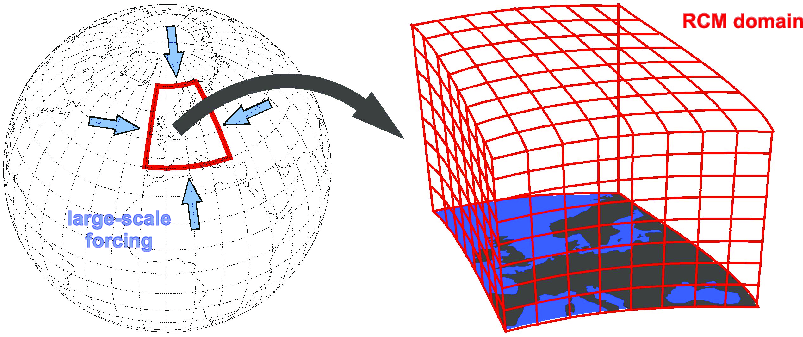
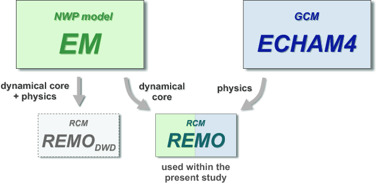
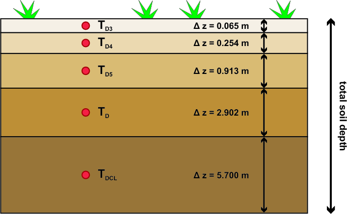
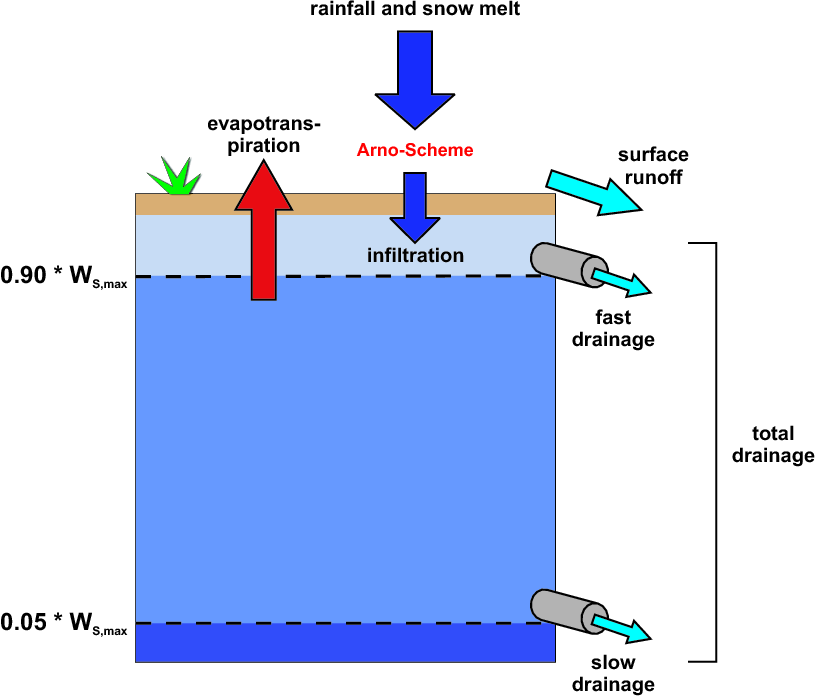

.. _cha_introduction:

Introduction [#phd_thesis]_
=================

In recent years, regional climate models (RCMs) have proved to be useful
tools for the analysis of regional energy and water cycles as well as
for the prediction of climatic changes on a regional scale
:cite:`Jacob2007,Jacob2001,Deque2007`. In contrast
to general circulation models of the atmosphere (AGCMs, or simply GCMs),
the model domain of an RCM does not cover the entire globe but is
typically restricted to some hundred to some thousand kilometers in x-
and y-direction. This feature allows the long-term simulation of
atmospheric processes with a high horizontal resolution at comparatively
low computational costs. Generally, a fine resolution is important to
resolve small-scale atmospheric circulations, for instance those
affected by orography or by details of the land surface
:cite:`McGregor1997`. The restriction to a certain
geographical region and the aim to simulate atmospheric processes on
climatological time scales (i.e., for much longer than just a few hours
or days) implies that information on the large-scale state of the
atmosphere outside the regional model domain has to be provided by
another source. These *lateral boundary conditions* (LBCs) can in
principle be derived from GCM simulations or, based on observations,
from global-scale analysis and re-analysis products. The latter are also
referred to as *perfect boundary conditions*
:cite:`Jacob2001` since they are based on the observed
state of the atmosphere and represent the best estimate of multi-decadal
time series of large-scale conditions. The RCM is said to be *nested
into* the respective large-scale forcing, a technique which is also
referred to as *physically based downscaling* and which is usually
carried out in a one-way mode (no feedback to the large scales).
Recently, also two-way nesting methods have been developed
:cite:`Lorenz2005`.

.. _fig_nesting:

   Nesting approach of a regional climate model like REMO.

General Characteristics
-----------------------

The regional climate model REMO
:cite:`Jacob2001,Jacob2001a,Jacob1997` is a
three-dimensional, hydrostatic atmospheric circulation model which
solves the discretised primitive equations of atmospheric motion. Like
most other RCMs, REMO has been developed starting from an existing
numerical weather prediction (NWP) model: the Europa-Modell (EM) of the
German Weather Service DWD :cite:`Majewski1991`.
Additionally, the physical parameterisation package of the general
circulation model ECHAM4 :cite:`Roeckner1996` has been
implemented, optionally replacing the original EM physics. In numerous
studies, the latter combination (i.e., the EM dynamical core plus the
ECHAM4 physical parameterisation scheme) proved its ability to
realistically reproduce regional climatic features and is therefore used
as the standard setup in recent applications, including the present
study (see :numref:`fig_remo_origin`).

The atmospheric prognostic variables of REMO are the horizontal wind
components, surface pressure, temperature, specific humidity and cloud
liquid water. The temporal integration is accomplished by a leap-frog
scheme with semi-implicit correction and time filtering after
:cite:`Asselin1972`. In the vertical, variations of the
prognostic variables (except surface pressure) are represented by a
hybrid vertical coordinate system :cite:`Simmons1981`. For
horizontal discretisation REMO uses a spherical Arakawa-C grid in which
all variables except the wind components are defined in the centre of
the respective grid box. The grid box centres themselves are defined on
a rotated latitude-longitude coordinate system. In its standard setup,
REMO uses a horizontal grid spacing of or , corresponding to horizontal
resolutions of about 18 km and 55 km, respectively. The time step length
is usually set to 100 seconds in the first case and to 240 seconds in
the latter. Recently, also simulations using higher resolutions of about
10 km have been successfully carried out (D. Jacob, pers. comm.).

As described in :numref:`cha_preprocessing`, the lateral boundary
conditions can either be provided by a GCM simulation or by re-analysis
or analysis products. In all cases, the relaxation scheme according to
:cite:`Davies1976` is applied: The prognostic variables of
REMO are adjusted towards the large-scale forcing in a lateral sponge
zone of 8 grid boxes with the LBC influence exponentially decreasing
towards the inner model domain. At the lower boundary, REMO is forced by
the land surface characteristics (see :numref:`sec_lss`)
and, over sea, by the sea surface temperature (SST) and sea ice
distribution. The SST can either be interpolated from the large-scale
forcing (if existent in there) or observational datasets, or can be
calculated online by a regional ocean model coupled to REMO
:cite:`Lehmann2004g`. The same is true for the sea
ice extent, which can as a further option also be diagnosed from the
SST.

.. _fig_remo_origin:

   Origins of the regional climate model REMO.

.. _sec_lss:

Land Surface Treatment
----------------------

Overview
~~~~~~~~

In REMO as well as in any other RCM, the land surface is treated with
special care. It plays a key role within the climate system, controlling
the partitioning of available energy into terrestrial radiation and
sensible and latent heat as well as the partitioning of available water
into evaporation and runoff over land areas. Furthermore, it is the
location of the terrestrial carbon sink. Due to this important role in
determining surface-atmosphere exchanges, it is necessary to represent
the land surface in an appropriate way in climate models which is
usually achieved by the incorporation of a more or less sophisticated
land surface scheme (LSS). The recent work by
:cite:`Pitman2003` provides a comprehensive review on the
different types of LSS used in climate models, ranging from simple
first-generation models :cite:`Manabe1969a` to
complex third-generation schemes which include the modelling of the
terrestrial carbon cycle.

According to the mentioned study, the LSS used in REMO can be classified
as a second-generation scheme, though the treatment of soil hydrology is
still based on the simple bucket scheme proposed by
:cite:`Manabe1969a`. In principle, the parameterisation of
land surface processes in REMO is derived from the parameterisation
scheme of the GCM ECHAM4 :cite:`Roeckner1996`, which in
turn is almost identical to the one used in the former version ECHAM3.
However, a number of modifications of the original ECHAM4 physics have
been carried out in recent years, especially related to subgrid surface
coverage, snow processes and the phase transformation of soil water
:cite:`Semmler2002` as well as to vegetation
characteristics :cite:`Rechid2006`. This chapter will give
a summary of the most important points with respect to the objectives of
the present study. For further details, the reader is referred to the
publications mentioned above.

Fractional Surface Cover and Turbulent Fluxes
~~~~~~~~~~~~~~~~~~~~~~~~~~~~~~~~~~~~~~~~~~~~~

.. _fig_tile_approach:

.. figure:: fig/tile_approach.png
   :width: 90.0%

   The tile approach. Example for a grid box covered by land (60%),
   water (30%) and sea ice (10%).

In the original ECHAM4 parameterisation, a model grid box consisted of
only one single surface type, i.e. was either covered by land, water or
sea ice (or permanently by glacier ice, see :numref:`Glaciers`. 
:cite:`Semmler2002` extended this concept for REMO by introducing subgrid fractions for each of the
three basic types (see :numref:`fig_tile_approach` for an example).
These fractions are not assumed to be located in a specific area of a
grid box but do simply cover a certain percentage of the total grid box
area, summing up to a total of 100%(\ *tile approach*). Applying this
technique, the consideration of a smoothed transition from land to sea
along the coastlines as well as from ice-covered to ice-free ocean
surfaces is possible. The water fraction of a grid box includes both
ocean surfaces and inland lakes. While the general land-sea distribution
remains constant throughout the model integration, the partitioning of
the total water fraction of a grid box into open water and sea
ice-covered parts can vary in time.

During the model integration, each surface fraction is characterised by
its own roughness length, its own albedo and its own, time-varying
surface temperature. The land fraction is further divided into a part
covered by vegetation and a bare soil fraction (see Chapter
[sec:remo\_vegetation]). Based on these characteristics, the turbulent
surface fluxes and the surface radiation flux are calculated separately
for each fraction and are subsequently averaged within the lowest
atmospheric level using the respective areas as weights.

On each fraction and within each time step, the turbulent fluxes of
momentum and latent and sensible heat are derived from the
well-established bulk transfer relations with the transfer coefficients
being obtained from Monin-Obukhov similarity theory
:cite:`Louis1979` with a higher order closure scheme. Over
land surfaces, the roughness length :math:`z_0` is geographically
prescribed as a function of subgrid-scale orography and vegetation type.
For the turbulent fluxes of sensible and latent heat :math:`z_0` is
restricted to a maximum value of 0.1 m. Over open water, the relation
after :cite:`Charnock1955` with a minimum value for
:math:`z_0` of :math:`\mathsf{1.5 \cdot 10^{-5} m}` with subsequent
reduction of the heat transfer coefficient is applied. Over sea ice a
constant value of :math:`z_0` = 0.001m is prescribed.

Vegetation and Land Use
~~~~~~~~~~~~~~~~~~~~~~~

Surface-atmosphere exchange processes over land are to a large extent
controlled by the physical properties of the soil and of the vegetation.
These characteristics include for instance the surface roughness length
(see above), the soil field capacity, the water holding capacity of the
vegetation, the background albedo (i.e., the albedo of a snow-free
surface), the fractional vegetation cover, the *leaf area index* (LAI),
etc. Some of these parameters strongly depend on the physiological state
of the vegetation and are therefore subject to a pronounced seasonal
variability (between growing and dormancy season) in many regions.
Nevertheless, a number of RCMs still neglect the annual cycle of
vegetation characteristics. In REMO, a seasonal variation of the
parameters

-  fractional vegetation cover

-  LAI (the ratio of one-sided leaf area to surface area)

-  background albedo

in each grid box has been introduced by :cite:`Rechid2006`.

Soil Processes
~~~~~~~~~~~~~~

Heat Budget
^^^^^^^^^^^

.. _fig_soil_layers:

   Soil temperatures and layering in REMO

The temperature profile in the soil is calculated applying a heat
conduction equation for five soil layers with increasing thicknesses
from the surface downwards (:numref:`fig_soil_layers`). A zero heat flux
condition is applied at the lowest boundary. Heat conductivity and heat
capacity of the soil layers depend on the respective soil type.
Additionally, a dependency of these two parameters on the soil water
content has been implemented by :cite:`Semmler2002`. Due to
some spurious influences on the model results, this feature has been
switched off in recent applications, including all simulations carried
out within the present study. :cite:`Semmler2002` also
introduced the freezing and thawing of soil water with the corresponding
release and consumption of latent heat.

Hydrology
^^^^^^^^^

The parameterisation of soil hydrology in REMO consists of budget
equations for the following three reservoirs:

-  the amount of snow accumulated on the surface (:numref:`Snow Cover`)

-  the amount of water in the skin reservoir (i.e., rain water and
   melting snow that is intercepted by the vegetation until its water
   holding capacity is reached)

-  the amount of water in the soil

.. _fig_soil_hydrology:

   Soil hydrology in REMO.

The latter is filled by infiltrating water (i.e., the amount of rain or
snow melt that does not enter the skin reservoir and does not run off on
the surface). The partitioning of the total amount of water available
for runoff generation into surface runoff and infiltration follows the
so-called *Arno-Scheme* :cite:`Duemenil1992` in which
surface runoff is computed as infiltration excess from a bucket-type
reservoir. However, in contrast to the simple bucket scheme originally
proposed by :cite:`Manabe1969a`, the subgrid-scale
heterogeneity of field capacities (i.e. of the total amount of water
that can be stored within a soil column) within a climate model grid box
is accounted for.

The amount of rainfall and snow melt that has passed the Arno-Scheme and
infiltrates into the soil is used to fill the soil water reservoir. From
here, subsurface drainage occurs independent of the water input if the
soil wetness is larger than 5% of the field capacity :math:`W_{S,max}`
(slow drainage). Once the relative soil water content reaches 90%, a
second, fast drainage component is additionally activated (:numref:`fig_soil_hydrology`). 
The sum of both drainage components equals the
total drainage, which is the subsurface counterpart of surface runoff.
Furthermore, soil water can be extracted by surface evaporation /
evapotranspiration which is computed from atmospheric demand and plant
physiological characteristics (see :numref:remo\_surface\_cover]).

Snow Cover
~~~~~~~~~~

.. _fig_snow_layers:

.. figure:: ./fig/snow_layers.png
   :alt: Snow layers and corresponding temperatures in REMO.
   :width: 80.0%

   Snow layers and corresponding temperatures in REMO.

The original snow parameterisation, which has been adopted from the GCM
ECHAM4, was substantially modified by :cite:`Semmler2002`
in order to improve the model performance in high-latitude regions. The
current parameterisation is still simple and computationally effective
compared to more complex, comprehensive snow schemes
:cite:`loth_diss:1995`.

In terms of heat conduction, an extra snow layer is considered up step,
the residual of the surface energy fluxes is then used to warm or to
cool an upper snow layer of :math:`SN_{up}` = 0.1 m thickness (or less
if the total snow depth is smaller). The corresponding upper layer snow
temperature is considered as the surface temperature :math:`T_S` of the
snow layer and serves as interface to the atmosphere (see Figure
[fig:snow\_layers]). The temperature :math:`T_{sn}` in the centre of the
whole snow pack is being interpolated from :math:`T_S` and the
temperature :math:`T_{D3}` of the uppermost soil layer. If :math:`T_S`
or energy input is used for snow melt. Snow density and heat
conductivity depend on the snow temperature :math:`T_{sn}` with both
parameters increasing with rising temperatures.

.. _fig_snow_albedo:

.. figure:: fig/snow_albedo.png
   :width: 95.0%

   Dependency of the snow albedo :math:`\alpha_{snow}` on snow surface
   temperature :math:`T_S` and forest fraction :math:`f_{forest}` in a
   REMO grid box.

The snow albedo :math:`\alpha_{snow}` is a function of the snow surface
temperature :math:`T_S` and of the forest fraction :math:`f_{forest}` in
a grid :math:`\alpha_{snow,max}`. For -10 :math:`\ \le\ T_S\ \le\ ` 0 it
decreases linearly until the minimum value of :math:`\alpha_{snow,min}`
is reached at :math:`T_S` = 0 (:numref:`fig_snow_albedo`). This
dependency on snow temperature accounts for the fact that wet snow
usually has a higher temperature and a lower albedo than completely
frozen snow :cite:`\[][see also Chapter
\ref{sec:surface_albedo}]{hall_jclim:2004}`. :math:`\alpha_{snow,max}`
and :math:`\alpha_{snow,min}` in turn depend on the forest fraction
:math:`f_{forest}` and vary from 0.4 to 0.8 and from 0.3 to 0.4
respectively (with the lower value for :math:`f_{forest}=1` and the
higher value for :math:`f_{forest}=0`).

The final albedo of a snow covered land surface :math:`\alpha_{surf}` is
a function of the background albedo :math:`\alpha_b` (see Chapter
[sec:remo\_vegetation]), the snow albedo :math:`\alpha_{snow}` and the
actual snow depth :math:`Sn`:

.. math::

   \label{eq:surface_albedo}
   \alpha_{surf}\ =\ \alpha_b\ +\ (\alpha_{snow}-\alpha_b) \cdot\
   \frac{Sn}{Sn\ +\ Sn^{\ast}}

with a critical snow depth :math:`Sn^{\ast}` = 0.01and
:math:`\alpha_{surf}` approaching :math:`\alpha_{snow}` for
:math:`Sn \gg Sn^{\ast}`.

Glaciers
~~~~~~~~

As most state-of-the-art climate models, REMO in its default version
uses a static glacier mask *GLAC* which is allocated at the start of the
simulation and which does not change with time. In the standard setup,
the mask is diagnosed at the very first model time step from the snow
depth interpolated from the driving field (LBC) during preprocessing. If
in a REMO grid box this interpolated snow depth is larger than 9.5, the
box is marked as glaciated (*GLAC*\ =1), otherwise as non-glaciated
(*GLAC*\ =0). Normally, this is only the case in regions which are
marked as “glacier” also in the driving model (e.g., over the Greenland
Ice Sheet). In REMO simulations over Europe, typically no single grid
cell on the European Continent is considered as being glaciated (Figure
[fig:glac\_ivecc]).

.. _fig_glac_ivecc:

.. figure:: ./fig/glac_ivecc.png
   :alt: Static glacier mask used in a standard REMO simulation over Europe.
   :width: 80.0%

   Static glacier mask used in a standard REMO simulation over Europe.

Grid boxes marked as “glacier” are assumed to be totally covered by ice.
The soil heat equations are solved for five layers, but assuming the thermal characteristics of ice. The
process of runoff generation on glacier ice is neglected. Both surface
runoff and drainage are set to zero in each time step. A snow pack on
top of the ice surface is not considered and therefore also snow melt
does not occur. Consequently, the water balance of these grid boxes is
not closed: The amount of solid and liquid precipitation does neither
accumulate on the surface nor run off but is simply lost. In the model
output, the snow depth does remain at its initial value larger than
9.5(which is important if double nesting is applied and a glacier mask
must also be derived for a subsequent model simulation at higher
resolution). Similarly to the snow albedo on the land fraction of
non-glaciated boxes, the albedo of a glaciated grid box is a function of
the surface temperature :math:`T_S` (see :numref:`fig_snow_albedo`),
varying between :math:`\alpha_{ice,max}` = 0.8 (for :math:`T_S \le `
-10) and :math:`\alpha_{ice,min}` = 0.6 (for :math:`T_S` = 0).

Also in grid boxes marked as “non-glaciated” (GLAC=0), surface ice cover
is in principle accounted for via its proportional contribution to the
mean grid box surface characteristics (e.g., mean surface roughness
length and mean leaf area index) as defined by the underlying, static
land surface parameter dataset
:cite:`hagemann_mpireport289:1999,hagemann_mpireport336:2002`.
The latter is based on a satellite-derived 1 x 1 global map of major
ecosystem types :cite:`loveland_intjrs:2000`, including one
type for “glacier ice”. It reflects the spatial distribution of
ecosystem types and the associated land surface characteristics for the
period 1992-1993. A special treatment has been implemented for the
surface background albedo (albedo of a snow-free land surface). In REMO
version 5.3 a mean monthly climatology of this parameter is computed
based on another high-resolution, satellite-derived albedo dataset
(MODIS) and monthly values of the leaf area index. In the Alps, the
methodology applied basically neglects the presence of glaciers on a
subgrid level since snow- and ice-covered pixels in the respective MODIS
scenes are excluded from the analysis. These pixels do not contribute to
the mean REMO grid box background albedo. Hence, the background albedo
of glaciated REMO grid cells in the Alps is systematically
underestimated. This fact is of major importance for the analysis of
differences in the simulated atmospheric parameters between REMO 5.3 and
(Chapter [chapter:results]).

Numerics
--------

The prognostic variables of the numerical scheme in REMO are surface
pressure, temperature, specific humidity, cloud water and the horizontal
wind components. They are calculated for each model timestep using the
leap-frog scheme with semi-implicit corrections and Asselin filter
:cite:`Asselin1972`. In the horizontal direction the
prognostic variables are defined on an Arakawa-C grid

.. _fig_arakawa_c_grid:

.. figure:: ./fig/arakawa_c_grid.png

   **Arakawa-C grid.** A grid box of an Arakawa-C grid is shown. Scalar
   values () are defined in the center of the grid boxes, while
   wind-vector components (:math:`u`, :math:`v`) are located at the
   border of the grid box

Scalar variables are located in the center of each grid box (two wind
vectors are located on the intersections between the grid boxes
meridional wind component, respectively). The advantage of the Arakawa-C
grid is that it better represents the phase speed and the group velocity
of the shortest waves than an unstaggered grid, where the speed of the
shortest resolvable wave is zero. The Arakawa-C grid is widely used in
atmospheric models, because it has the best dispersion properties of all
Arakawa grids. Grid centers are located on a rotated latitude-longitude
grid.

The vertical direction is discretized using a hybrid sigma-pressure

.. _sigma_coordinates:

.. figure:: ./fig/sigma_coordinates.png

   :math:`\sigma`-coordinate system. The vertical grid consisting of
   a :math:`\sigma`-coordinate system is shown. Scalar values () are
   defined in the center of the layers (at full-levels), while vertical
   velocities (:math:`w`) are located at the layer boundaries (at
   half-levels)

The lowest levels near the surface are mainly terrain-following. With
increasing height, the influence of the orography on the level-shape
decreases until the uppermost levels are equal to pure pressure levels.
The vertical levels extend up to 10. Prognostic variables are stored on
full-levels in the center of each layer (in Vertical velocities are
defined on half-levels at the layer boundaries (Throughout this study a
vertical grid consisting of :math:`k=31` layers is used.

The horizontal standard resolutions of REMO are (ca. 55), (ca. 18) and
(ca. 10) with a timestep of 240, 100and 30, respectively. The vertical
standard resolution consists of 20 or 31 sigma-levels. In this study the
horizontal resolution of is used with a timestep of 240and a vertical
resolution of 31 sigma-levels.

An RCM simulates meteorological processes on a part of the globe – the
model domain. Processes outside the domain – although potentially
important – are not calculated by the regional model itself. They are
taken into account using model output from a global model, which is
usually performed on a much coarser horizontal resolution than the
regional model.

At the lateral boundary the prognostic variables surface pressure,
temperature, the two horizontal wind components and specific humidity
are prescribed by global meteorological fields. They are adjusted in a
lateral boundary zone of eight grid boxes according to
:cite:`Davies1976`: The influence of the large-scale
driving fields decrease exponentially going from the lateral border of
the domain towards the center. At the lower boundary the model is forced
by the sea surface temperature (SST) and by the sea ice distribution
over sea. The SST and the sea ice distribution can be taken from a GCM,
re-analysis or observation data. It is also possible to couple REMO with
a regional ocean model where the SST and the sea ice extend are
calculated online. The sea ice distribution can also be diagnosed from
the SST. Over land, surface characteristics such as surface roughness
length, surface albedo, vegetation ratio and leaf area index determine
the lower boundary condition for the atmosphere together with surface
temperature and moisture. The surface characteristics are prescribed
during the simulation. While the roughness length is constant with time,
surface albedo, vegetation ratio and leaf area index are prescribed on
an annual cycle :cite:`Rechid2006`.
Surface temperature and moisture are initialized at the beginning of the
simulation. During the simulation they are calculated by the soil scheme
of REMO without further external forcing. There is no forcing for the
meteorological prognostic species at the upper boundary.

As global meteorological driving fields re-analysis data, e.g., from the
National Center for Atmospheric Research (NCAR) or the European Center
for Medium-Range Weather Forecasts (ECMWF) can be used as well as
boundary data from GCMs like ECHAM5. Throughout this study the ERA-40
re-analysis data :cite:`Uppala2005` from the ECMWF is used
as lateral boundary forcing for the meteorological prognostic variables.
The sea surface temperature as well as the initial meteorological fields
are also taken from the ERA-40 re-analysis data.

Subgrid scale physical processes that are not resolved by the model can
still be important for the quality of the model results. Those processes
have to be parametrized using the prognostic variables calculated by the
model. As mentioned above, the physical parametrization included in REMO
follow those of the GCM ECHAM4 with several modifications (for details
refer to :cite:`Jacob2001,Jacob2007`). Additionally a
fractional surface cover was introduced by
:cite:`Semmler2002` which takes into account the different
subgrid scale surface processes on land water and sea ice. The monthly
variation of the vegetation parameters background albedo, leaf area
index and vegetation ratio were included in REMO by
:cite:`Rechid2006`. The cumulus convection mass flux scheme
is parametrized after :cite:`Tiedtke1989` with
modifications after :cite:`Nordeng1994`. It has been
modified for chemical tracers in the frame of this study. This is
described in .

.. rubric:: Footnotes

.. [#phd_thesis]
   based on PhD Thesis “A Subgrid Glacier Parameterisation for Use in
   Regional Climate Modelling” (Chapter 3) by Sven Kotlarski and
   “Climate and Air Pollution Modelling in South America with Focus on
   Megacities” (Chapter 2) by Claas Teichmann

.. bibliography:: references.bib
   :style: plain
