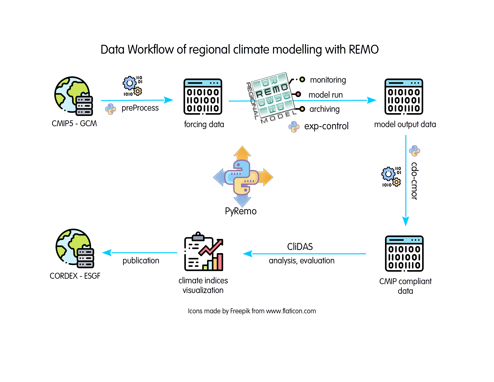

Preface
=======

This document should be a comprehensive guide for all users who wish to use the REMO model
for scientific purposes. It also gives an introduction to the preprocessing and postprocessing
workflow that is neccessary to successfully prepare for and analyze data of a downscaling experiment
with the REMO model. This user guide is *not* meant to be a scientific documentation but
rather a technical one and we try to describe the framework and functionalities of the model
so that the user can make basic adjustments to the code itself. However, for a basic understanding
of the functionalities and capabilities of the model, we give a brief theoretical introduction in 
:numref:`cha_introduction`. so that the user gets an overview of what experiments might be possible
with the model. Additionally, the user is also invited to have a look at the code documentation 
that is given in the model source code itself. Although we try to stay as generic as possible concerning
the machine where the model is run, we often describe some details about how to run REMO at the
DKRZ on the MISTRAL Intel machine in Hamburg in the GERICS framework since a lot experiments are run 
there. However, all scripts and codes are, in principle, generic so that is should be possible to run
the REMO model and all tools concerning pre and postprocessing on any HPC framwork.

Model History [#remo_homepage]_
-------------

REMO was developed upon the request of the reviewers within the BMBF-Förderschwerpunkt Wasserkreislauf 
as the atmospheric component of the coupled atmosphere-hydrology model system. Development and application 
of this system was considered a central task within the international BALTEX (BALTIC Sea Experiment).
MPI-M (Max Planck Institute for Meteorology) was thus asked to develop the German BALTEX Model on the basis 
of the former numerical weather prediction model of the German Weather Service (EUROPA-MODELL, EM, :cite:`Majewski1991`) 
in co-operation with DKRZ, DWD and GKSS. 
On Nov 16th, 1993 it was agreed between these parties to develop a regional model suitable for climate modelling 
and weather forecast which subsequently was named REMO. DWD and GKSS concentrated on modifications of the EM 
to use REMO in forecast mode (e.g. consecutive 30 hour forecasts without data assimilation) whilst DKRZ and MPI-M
focussed on developments needed for the use of REMO in climate mode.
A version of the EM which allowed to carry out long term runs was modified at MPIfM to use surface pressure,
horizontal wind components, temperature, water vapour and cloud water content as prognostic variables instead 
of surface pressure, horizontal wind components, total heat and total water content. The EM physical parameterisation 
scheme remained otherwise unchanged but the physical parameterisation scheme of the global climate model ECHAM4 (:cite:`Roeckner1996`) 
was implemented as an alternative option.
A major objective of BALTEX is to understand and quantify the water and energy cycles over the Baltic Sea and its drainage basin.
Therefore the validation of REMO concentrated on the hydrological components of the water cycle. Simulation results of long runs 
up to ten years using ECMWF re-analysis data as lateral boundary conditions have been compared successfully with observations (Jacob 2001).
Furthermore, REMO participated in a model inter-comparison during the PIDCAP period (Pilot study of Intense Data 
Collection and Analyses of Precipitation) involving eight regional models in total (:cite:`Jacob2001`).
REMO runs on various platforms including scalar and vector computers such as CRAY, NEC, IBM, DEC, HP, SGI and Linux workstations.
A parallel version (MPI) is also in use. Horizontal resolutions between 1/10° and 1° are currently used for simulations covering 
time ranges from days to centuries with both parameterisations. The following regions have been investigated with 
REMO: Europe, Arctic, Antarctic, Siberia, Indonesia, India, Brazil, Peru, Africa, North America, Baltic Sea, North Sea, North Atlantic, Pacific.
The atmospheric model REMO is coupled to three different hydrology models and three ocean/sea-ice models. An on-line chemistry module for tropospheric chemistry is available.
REMO is used by about 15 institutes in Germany, France, Switzerland, Greece and China. Interest in its use has been expressed 
by a number of further institutes in Germany and beyond. Numerous other institutes analyse the output generated by REMO.
During the next four years, REMO will be used as the atmospheric component of BALTIMOS (BALTEX Integral MOdel System) 
which is the BMBF funded nine partner consortium Development and validation of a coupled model system for the Baltic region.
BALTIMOS consists of the modules: atmosphere, sea ice, ocean, land surface and hydrology. The main activity will be the 
validation of the fully coupled system. Furthermore, REMO is embedded in several other national and international projects for the next years. 

remo2
-----
The remo2 version implements a new software architecture, that is based on the Flash Code (:cite:`FLASH2013`)
by the Flash_ Center for Computational Science. The main directory of remo2 looks like:

::

    bin/                    # bin directory for python source code
    ChangeLog              
    doc/                  
    jobs/                   # job directory with test scripts
    lib/                    # directory that manages external dependencies
    README.md   
    setup                   # main setup script that controls source code configuration
    sites/                  # Makefile configurations for different machines
    source/                 # Fortran source code

The main difference to earlier model versions is that there is no main directory for the source code (like `CODE`) any more. 
Instead, the source code is scattered into a number of subdirectories in the `source` directory. A script called `setup` 
is provided that manages different source code configurations. The main task of the `setup` script is to scan the `source`
directory and link all source files into a subdirectory depending on the configuration the user requests. The idea
is to have more control over the source code and how it is combined into an application that serves the needs of the
user's experiment. The main model configurations can be found in the `source/Simulations/SimulationsMain` directory
which can be used during the model setup step, e.g.,

::

    ./setup -auto Remo2015 -objdir=Remo2015

This command will create a subdirectory called `Remo2015` that contains only links to source code that is 
required by the configuration defined in `source/Simulations/SimulationsMain/Remo2015` 

.. _Flash: http://flash.uchicago.edu

REMO 2015
---------

The REMO 2015 model version included some improvements concerning

-  memory management and memory requirements (:numref:`cha_memory`),

-  source code design and modular implementations,

-  netcdf in and output,

-  non-hydrostatic dynamics.

In the current REMO version, new functionalities (mainly IO and some
admistrative subroutines) are partly implemented in Fortran 90 modules
(source files beginning with ``mo_``) while most of the legacy code
still fullfills Fortran 77 conventions. All files using the ``.f90``
suffix make use of full Fortran 90 capabilities while files ending with
``.f`` will be compiled with Fortran 77 restrictions.

All implicit declarations have been removed and are now forbidden by
using ``IMPLICIT NONE`` statements in all headers (subroutines, modules
and module procedures). Because of that, the old implicit data type
rules have been relaxed (e.g., the first letter of a variable does not
neccessarily indicate its datatype any more although it’s still the case
for the Fortran 77 routines). Common Blocks have also been removed and
converted for Fortran modules which are still located in the ``CBS``
subdirectory.

Furthermore, the rather long main driving routine from ``ec4org.f`` has
been split into 3 subroutines implemented in ``init_remo.f90``,
``timeloop.f90`` and ``finish_remo.f90`` which are now called in the
main driving routine in ``control.f90`` which is called from the old
main program in ``remorg.f``. The new structure of the driving routines
simplifies the memory allocation and deallocation, avoids code
duplication for the new Netcdf IO and reduces the length of single
subroutines for better overview and understanding.

In addition to that, the main fields and data arrays that were used to
be declared as local variables in ``ec4org.f`` have been moved to
Fortran 90 modules (usually beginning with ``mo_memory_...``) and are
now dynamically allocated at the beginning of the REMO run (in
``init_memory.f90``). The fields can have up to three spatial dimensions
(longitude, latitude and level) and one time dimension (for dynamic
variables). The fields are allocated as part of a derived datatype
called ``memory_type`` in ``mo_linked_list.f90`` and it combines a 4D
pointer with meta information that was previoulsy stored in the
``emgbri`` common block. The new design allows for a combination of data
and meta information for easier output management. The fields are
organized in streams for easy access and better output performance. The
main REMO stream is called ``REMO_TABLE`` and is declared in
``mo_memory_main``. See Chapter [cha:memory] for a more detailed
description.

The new management of memory and data IO also has the advantaged that
the resolution and grid parameters of the model are not specified at
compilation time anymore and are not neccessarily part of the namelists
anymore. Instead, grid parameters can be read directly from input files
and REMO can allocated memory automatically matching the requirements.
Therfore, specifiying the resolution of the model in ``param.h`` becomes
obsolete and has been removed. This allows for one executable suitable
for any kind of REMO experiment.

The ``param.h`` file has been replaced by a module of the same name
(``mo_param``). The module contains some runtime parameters that can not
be controlled by namelist input. These are usually some parameters that
should be fixed for a model configuration at compilation time and mainly
concern some netcdf output parameters right now. Have a look at the
source code of the module.

There is still an inconsistency in the model of how to work with 2D and
3D data. In the original ec4org routine, most 2D and 3D fields were
declared holding one rank for the horizontal dimensions (e.g.,
``FIB(IEJE)``) where ``IEJE`` is the product of the number of
longitudinal cells (``IE``) and lattitude cells (``JE``), e.g.,
``IEJE=IE*JE``. On the other hand, some 3D fields had been declared
using two ranks for the horizontal resolution, one for each the
longitude and latitude (e.g., ``T(IE,JE,KE)``). When these fields are
passed to subroutines, e.g. ``PHYEC``, the rank of these fields is often
implicitly changed, e.g, the dummy argument for the temperature in the
subroutine is declared as ``T(IEJE,KE)``. This is due to the long
history of the code and the fact, that is has been combined from two
different models (see Chapter [cha:introduction]). However, this
practice has been banned with Fortran 90 standards although it is still
possible if no interfaces are checked during compilation, e.g, when the
subroutine is not part of a module. In general, it is possible due to
the order of arrays in the memory (the first index is the most rapidly
changing one). Right now, all pointers in ``mo_memory_main.f90`` in the
``REMO_TABLE`` have two ranks for the horizontal dimensions. However,
they could also be declared with one ranks since the subroutines in
``mo_memory_base.f90`` will catch this case.

The new REMO version now supports in and output of model data in the
netcdf format. In and Output can be chosen independendtly from each
other so that old forcing files in IEG format can still be used while
output can be written in netcdf format. For more details on how to
compile with netcdf support, have a look at Section
[sec:compilation\_netcdf]. Also the preprocessor can now create
forcing data (a-files) in netcdf format which allows for model runs
with more than 50 model levels. The Netcdf support is handled using
preprocessor statements and the user has to decide at compilation time
which file format should be used for the model run. However, the old
IEG output is still available although it does not make use of the
stream datatype and but rather copies the content of the pointer
variables into an output field in ``putec4.f``. The same is true for
data input by IEG forcing files in ``puteca.f``. Therefore, special
attention is still needed if new variables are added for output in IEG
format.

REMO Data Workflow
------------------

.. _fig_data_workflow:

   Data Workflow in a REMO experiment.

Version Overview
----------------

.. csv-table:: Overview of Legacy Versions
   :file: remo_versions.csv
   :widths: 10 30
   :header-rows: 1

.. rubric:: Footnotes

.. [#remo_homepage] https://remo-rcm.de/
